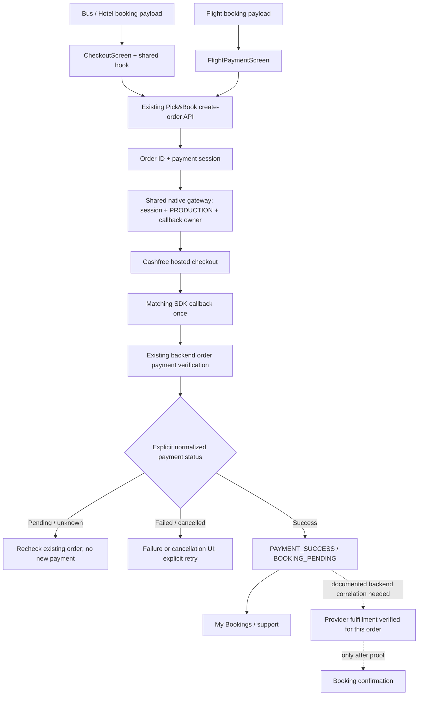

# Phase 1 — Cashfree architecture and payment testing

Date: 2026-10-07 (Asia/Calcutta). Source: current live PickNBook working tree, not the older ZIP. Phase 0 was read, not repeated. Initial Git state was clean on `main`.

## Outcome and scope

Native Cashfree checkout is centralized in a small gateway. Bus/Hotel now require an explicit paid/success verification state; Flight uses the installed SDK correctly, waits for its callback and no longer confirms the first booking in history. Verified payment is displayed separately from pending booking fulfillment.

This implements mobile correctness safeguards; it is not proof of production payment or provider fulfillment. No real order, charge, refund or provider booking was created during this work. Runtime acceptance of this change requires a Google Play-distributed testing build and a documented backend contract.

Preserved: PRODUCTION environment, both payment endpoints, request JSON field names, booking types, customer/passenger payloads, fare calculations, webhook/return URL behavior, bearer authentication, Cashfree versions, Expo/RN versions, package identity, EAS project/configuration and Android/JDK setup. No Phase 2 networking consolidation, screen redesign, list/image optimization, background cleanup or dead-code deletion was performed.

## Installed SDK verification

The local packages are the technical source of truth:

| Package/source | Confirmed API |
| --- | --- |
| `react-native-cashfree-pg-sdk` 2.4.0, `src/index.ts` and declarations | Exports singleton `CFPaymentGatewayService`; does not export session/environment constructors |
| `cashfree-pg-api-contract` 2.1.1, `dist/index.d.ts` | `CFSession(sessionID: string, orderID: string, environment: CFEnvironment)`; enum includes PRODUCTION and SANDBOX |
| Gateway `doWebPayment(cfSession: CFSession)` | Hosted checkout launch; returns void, not a promise of payment completion |
| Gateway `doPayment(checkoutPayment: CheckoutPayment)` | Different checkout-payment input; passing a bare session was incorrect |
| `setCallback({ onVerify, onError })` | Installs shared success/failure listeners; must precede launch |
| `removeCallback()` | Removes stored subscriptions; repeated registrations without cleanup can orphan listeners |
| `CFErrorResponse` | Provides getStatus/getCode/getMessage/getType methods; errors are not necessarily ordinary Error objects |

The official [Cashfree React Native guide](https://www.cashfree.com/docs/payments/online/mobile/react-native) supports the session/hosted-checkout/callback/server-verification separation. The installed declarations, rather than snippets from other SDK versions, governed this change. No SDK patch or upgrade was made.

## Before

Bus/Hotel:

```text
PostBusBooking / HotelPassengerDetails -> CheckoutScreen -> useCashfreePayment
  -> cashfreeApi.createOrder -> native session / doWebPayment
  -> callback -> verifyPayment -> any HTTP success became payment success
  -> generic screen claimed booking confirmation
```

Flight:

```text
FlightPaymentScreen -> cashfreeService.createCashfreeOrder
  -> CFSession/CFEnvironment required from wrong package
  -> doPayment(session), log-only callbacks, no owner cleanup
  -> SDK launch exception swallowed -> processing anyway
  -> verifyFlightPayment -> my-bookings[0] -> default Booked/confirmation
```

The live tree had gained inline flight callbacks since Phase 0; they logged callbacks but did not fix imports, launch input, lifecycle or fulfillment correlation.

## After



The dotted fulfillment path is a required backend contract, not an implemented or invented endpoint. Mobile does not call SRDV or cause fulfillment based on a callback. Backend webhook/provider fulfillment ownership remains unchanged.

| Stage | What is actually known |
| --- | --- |
| Order created | Backend returned an order/session; money is not yet verified |
| Checkout launched | Native launch returned without throwing; no payment result is implied |
| SDK callback | Checkout asks the app to verify, or reports an error/cancellation; still not authoritative payment proof |
| Payment verified | Existing authenticated verification endpoint explicitly says paid/success/completed for the requested order |
| Booking fulfilled | Requires an order-correlated booking/ticket/room result and explicit fulfillment status; unavailable in the current proven client contract |

## Shared native gateway ownership

`src/services/cashfreeGateway.js` owns imports, input validation, session creation, the single PRODUCTION selection, checkout launch and callback installation/removal. It contains no backend request, booking payload, navigation, persistence, wallet or SRDV logic.

An owner reserves the singleton before awaiting order creation. A second owner is rejected. The owner installs callbacks once before launching; matching order IDs and owner identity are checked. A callback disposes its owner before notifying the screen/hook, preventing duplicate verification/navigation. Late callbacks from disposed owners and other order IDs are ignored. Unmount, incomplete order responses and synchronous launch/registration errors release ownership. Disposing an older owner cannot remove a newer owner's callbacks.

No effect registers callbacks every render/token update. No AppState listener interprets pause/resume as failure or creates a second order. A deliberate Recheck Payment action can recover when checkout returned without a callback: it removes the callback and verifies that same order. Missing/mismatched callback order IDs cannot authorize payment success.

`cashfreeGateway.web.js` rejects native checkout before order creation. The existing `useCashfreePayment.web.js` fallback remains. There is no development/sandbox environment switch.

## Bus and Hotel behavior

Both continue through `CheckoutScreen` with their existing inputs and backend request. `PostBusBookingScreen.jsx` and `HotelPassengerDetailsScreen.jsx` were inspected and left unchanged. Their pricing, block calls, guest/passenger data and business rules were not refactored.

The hook uses a synchronous ref guard across create-order, checkout and verification. Checkout also guards the asynchronous token-read window and passes the resolved token directly, avoiding use of a stale hook token on the first tap. Order ID/uncertainty are checkpointed in the existing route params; a remounted route rechecks rather than blindly starting again.

States: idle, creating_order, awaiting_payment, verifying, success (payment only), failed, cancelled, pending, unknown and launch_failed. Failed/cancelled backend payment allows explicit reset/retry. A native launch throw retains its order/session in memory so retry reopens the same order; Recheck Payment is also available. Pending/unknown and malformed create-order responses cannot start another order from that checkout. Known validation/auth request rejection can return to retry; transport errors, timeouts, conflict responses and server errors remain uncertain.

Success renders the existing confirmation component with explicit `paymentVerified` evidence and **booking confirmation pending** copy. Directly entering that component without payment proof displays pending rather than successful payment. The failure component distinguishes cancellation and no longer promises that nothing was deducted or that refunds happen automatically.

## Flight behavior

Flight keeps its existing create-order payload, fare calculation and processing screen. A synchronous guard prevents repeated orders; the Pay button stays disabled through native launch and callback handoff. Review data for an already created order is retained in memory for its retry. Session construction/launch failure stays on the payment screen with an alert and a same-order retry/recheck path.

On a matching callback, navigation **replaces** the payment screen with processing exactly once. Processing does not begin merely because the void launch method returned. An SDK error/cancellation triggers backend verification, not ticket fulfillment; safe cancellation/trusted-source messages are retained. A manual recheck recovers a missing callback. No payment session is newly passed to the processing route. An existing wallet-fully-paid response still bypasses native checkout but must pass backend verification; `useWallet: false` in the request was preserved.

After explicit backend failure/cancellation, Try Again replaces processing with the payment screen and clears the route's uncertain-order checkpoint. It does not create an order until another deliberate Pay tap. Pending/timeout rechecks the same order. Success stays at **Payment Confirmed / Booking Pending**, offering My Bookings; it does not navigate to a fabricated ticket.

The separate FlightConfirmation screen now requires explicit fulfillment evidence plus a real booking identifier and a positive ticket status before showing confirmed content. Missing/legacy default ticket status is not enough. Ticket actions are disabled while unverified. No new payment flow currently manufactures that evidence.

## Verification contract and normalization

No backend source, authenticated production response fixture or documented fulfillment contract was supplied. The following are **supported by existing mobile parsing**, not an assertion that every spelling has been observed from production:

| Existing field/shape | Handling |
| --- | --- |
| `status`, `Status`, `paymentStatus`, `PaymentStatus` | Read explicit strings, case-insensitively; payment-specific fields take priority over generic wrapper status |
| Existing `data`/`result` wrappers, including the prior two-level combinations | Inspect the same bounded wrapper shapes; contradictory statuses remain UNKNOWN |
| SUCCESS / PAID / COMPLETED | SUCCESS; these success aliases were already recognized by flight parsing |
| FAILED / EXPIRED | FAILED; expired was previously grouped with failure |
| CANCELLED | CANCELLED, now separate from failure |
| PENDING | PENDING |
| CANCELED / USER_DROPPED / NOT_ATTEMPTED | Defensive handling of cancellation/nonpayment states requested in Phase 1; production occurrence needs backend confirmation |
| Missing, boolean, numeric, unknown, conflicting or array response | UNKNOWN; never infer success from HTTP 200, `success: true`, order creation or an arbitrary first payment attempt |
| Explicit returned order ID disagrees with the requested order | UNKNOWN |

Creation still accepts the application's existing camel/snake-case order/session aliases. Both flows normalize verification with `paymentStatus.js`. The existing order endpoint itself scopes responses lacking an echoed ID; backend enforcement of that scope still requires validation.

No unsupported response property such as `bookingFulfilled` is assumed to come from the backend. That marker is a guarded future UI input, not a new API field. Amounts, timestamps, payment references and default values do not establish payment or booking success.

## Why flight correlation remains pending

| Location | Available identifiers | Why this is insufficient |
| --- | --- | --- |
| Create-order parser | cashfreeOrderId/orderId/order_id, cfOrderId, session | Identifies payment/order, not the provider booking |
| Flight booking JSON | TraceId, ResultIndex, SrdvType/SrdvIndex | Search/provider request identifiers; uniqueness across payment retries/fulfillment is not documented |
| Verification parser | paymentReference, cashfreeOrderId | No proven relationship from paymentReference to a booking ID, PNR or BookingReference |
| Existing my-bookings consumer | Id/id/BookingId, Pnr/pnr, BookingReference, Status, Passengers | No proven common identifier with the newly paid order; sort order is not correlation |
| Local flow state | Search/fare/passenger/optional booking fields | Local defaults and timestamps cannot prove backend fulfillment |

The unsafe history lookup and both `Booked` fallbacks were removed from processing. There is no heuristic match by passenger, time, amount, search trace or first result. The service's existing history method remains available to other callers; no endpoint was removed.

Backend work/clarification required before automatic confirmation:

1. Provide a documented, unique mapping from the verified payment order to its booking record and explicit fulfillment outcome, including paid-but-pending/failed/refunded cases. Prefer extending/documenting existing response contracts; no speculative endpoint is implemented here.
2. Confirm aggregate payment-status semantics, response wrappers and order-ID scoping with redacted fixtures for all terminal/nonterminal cases.
3. Confirm create-order idempotency and durable recovery after app termination, network ambiguity and a wholly new booking screen. Client guards protect mounted owners and retained routes; they cannot guarantee exactly-once charging across process restarts/devices.
4. Provide an explicitly customer-safe provider-unavailable error contract. Current handling preserves recognized safe messages and hides internal balances/credentials; arbitrary diagnostics use a generic message.

SRDV insufficient wallet balance remains an operational/backend condition. No wallet bypass, forced Cashfree opening or provider-fare change was made.

## Polling and lifecycle

| Behavior | Before | After |
| --- | --- | --- |
| Initial/pending delay | 3,500 ms | Preserved |
| Network retry delay | 4,500 ms | Preserved |
| Maximum flight attempts | 20 | Preserved; not a strict 70-second wall-clock deadline |
| Manual flight recheck delay | 500 ms | Preserved, guarded against starting a second loop |
| Flight HTTP timeout | 30 s Axios | Preserved; abort signal added for cleanup |
| Loop | Screen-owned timeout chain | Small tested sequential poller, one timer/request, generation guard, cleanup abort, terminal stop |
| Verification success | Booking-history lookup/default confirmation | Payment verified, booking pending; no further payment poll or automatic charge |
| Unmount | Timer/state guard, request could continue | Timer stopped, request aborted, stale completion suppressed, animations stopped |
| Shared bus/hotel verification | Raw fetch without bound | Manual recheck; 30 s abort bound matching existing flight client, plus abort on unmount |

Background/foreground does not reset the order or restart a loop. Actual Android activity/native SDK behavior, including process death, requires Play testing. No broad background/location architecture changed.

## Payment logging

Removed application console logging from the touched payment hook, API services, Checkout, flight payment/processing/confirmation paths. Logs no longer print session responses, order error payloads, customer contact, flight/seat/passenger flow data or arbitrary SDK errors in those files. User-visible server errors are allowlisted/mapped to safe text; raw balances are never shown.

Untouched booking/provider services may still log sensitive data noted in Phase 0. Installed SDK 2.4.0 also contains its own console logging in callback/error parsing; it was not patched. This phase is not a claim that the whole application's logging is clean.

## Validation and reproducibility

Run focused tests with `node --test __tests__/payments.test.cjs`. They use Node's built-in runner and already installed Babel, with isolated SDK/network mocks and a small hook/render harness. No new test framework or dependency was installed. These exercise actual helper/hook/screen code but do not emulate Android native UI or prove backend behavior. Existing flight-result selector tests were not changed; the project still has no configured Jest runner.

Validation performed:

- Expo Doctor: **18/18 passed**. An npm upgrade notice was informational; npm was not upgraded.
- Android build: **BUILD SUCCESSFUL in 6m 50s**, 538 tasks (39 executed, 499 up to date), using the existing JDK 17 project setup, both arm64-v8a and armeabi-v7a. Existing Gradle deprecation/NODE_ENV warnings remained nonfatal.
- Android Metro export: succeeded, including the new native gateway and helper imports. A final export/check is recorded in the final validation section below.
- AST review confirmed that flight fare expressions, passenger/booking builders, Checkout's outgoing payload and Flight's create-order JSON were unchanged.
- Protected files/configuration (`eas.json`, `app.config.js`, package manifests/lockfile, `.env`, Android/JDK configuration) have no Phase 1 diff.
- Initial restricted execution could not access npm/Gradle caches/network. The authorized checks were rerun with normal user cache access; these were environment failures, not application regressions.

Build command from `android`:

```powershell
.\gradlew.bat app:assembleDebug -x lint -x test --configure-on-demand --build-cache -PreactNativeDevServerPort=8081 '-PreactNativeArchitectures=arm64-v8a,armeabi-v7a' --console=plain
```

Other commands: `npx.cmd expo-doctor`; `npx.cmd expo export --platform android --output-dir .android-toolchain/phase1/export --no-bytecode`; source SDK searches; `git diff --check`, `git diff --stat`, `git status --short`. Logs and scratch scripts are ignored under `.android-toolchain/phase1/`. No changes were committed/staged.

## Device and production testing

ADB detected CPH2381 in `device` state. Package installer query reported `com.android.vending`. The main activity was resolved from the installed package, then launched through ADB. Android returned `Status: ok` and delivered the intent to an already running activity (TotalTime 0, WaitTime 125 ms); this is not a cold-start or payment result.

The existing Play installation was preserved. The changed debug APK was not installed over it. Therefore no native runtime or production-payment case for this changed code is marked passed. User-reported prior Play testing established that the trusted-source error disappeared and a later SRDV wallet shortage blocked order creation; those are historical user observations, not new Phase 1 test executions.

Production validation must use a new Google Play-distributed test build with provider funding and backend observability. No installer spoofing, SDK integrity change or sandbox switch was attempted. See [PHASE_1_PAYMENT_TEST_MATRIX.md](PHASE_1_PAYMENT_TEST_MATRIX.md).

<!-- Final validation and exact SDK search follow. -->

## Exact remaining native SDK occurrences

Final application search: `rg -n 'CFSession|CFEnvironment|CFPaymentGatewayService|doWebPayment|doPayment|setCallback|removeCallback' src`.

All matches are in **`src/services/cashfreeGateway.js`**:

| Line | Occurrence |
| --- | --- |
| 1 | CFPaymentGatewayService import from native SDK |
| 2 | CFSession and CFEnvironment imports from contract package |
| 21 | CFPaymentGatewayService.removeCallback |
| 42 | new CFSession with CFEnvironment.PRODUCTION |
| 44 | CFPaymentGatewayService.setCallback |
| 50 | CFPaymentGatewayService.doWebPayment |

No application doPayment use, duplicate environment selection or direct screen/hook native SDK import remains. Web fallback files contain no native SDK imports.

## File review

| File | Change |
| --- | --- |
| `src/services/cashfreeGateway.js` | New native-only adapter and singleton ownership |
| `src/services/cashfreeGateway.web.js` | Native checkout unavailable on web, before order creation |
| `src/services/paymentStatus.js` | Pure response/status, cancellation, booking-state and safe-error helpers |
| `src/services/paymentPolling.js` | Small sequential, abortable flight verification loop |
| `src/hooks/useCashfreePayment.js` | Shared Bus/Hotel state, guards, callback handoff, verification and same-order recovery |
| `src/services/cashfreeApi.js` | Safe create errors, local-validation rejection marker and verification abort signal; request payload/headers preserved |
| `src/services/cashfreeService.js` | Shared normalization, safe order errors/ID aliases and verification abort signal; request payload/headers preserved |
| `src/screens/CheckoutScreen.js` | Guard token-read/pay entry, retained route checkpoint and explicit pending/recheck states |
| `src/screens/BookingConfirmationScreen.js` | Require payment proof; payment success explicitly leaves booking pending |
| `src/screens/BookingFailureScreen.js` | Cancellation/recheck support; remove unsupported no-debit/refund assurance |
| `src/screens/dashboard/bottomTabScreens/flights/FlightPaymentScreen.jsx` | Adapter, guarded launch/handoff, launch-error recovery and retained order review context |
| `src/screens/dashboard/bottomTabScreens/flights/FlightPaymentProcessingScreen.jsx` | Safe poller, no first-booking/default-confirmation path, honest pending/failed/cancelled states |
| `src/screens/dashboard/bottomTabScreens/flights/FlightConfirmationScreen.jsx` | Unverified/default state cannot display confirmed booking; sensitive logs removed |
| `__tests__/payments.test.cjs` | Focused mock-backed tests with existing tools |
| `docs/PHASE_1_CASHFREE_ARCHITECTURE.md` | Architecture, contract limits and validation |
| `docs/PHASE_1_PAYMENT_TEST_MATRIX.md` | 69 scenario rows across the three booking types |

Final unit run: **48 passed, 0 failed, 0 skipped**. Includes normalization, conflicting/wrong-order input, safe error messages, singleton ownership, stale/duplicate callbacks, failed registration/launch, double taps, same-order retry, manual callback-loss recovery, retained-route re-entry, unmount cleanup, sequential polling, unknown/network outcomes, honest booking-pending rendering and flight coupon retention. A regression test also covers an uncertain create-order response before asynchronous route params update. These are automated mock tests, not live payment passes.

Final native validation: **BUILD SUCCESSFUL in 1m 19s**, 538 tasks (30 executed, 508 up to date), with the same Gradle command/JDK configuration. The final Android JavaScript export also succeeded at `.android-toolchain/phase1/export-final`; debug assembly itself is not a production JS bundle or release validation.

Final review found no unintended pricing/payload/configuration change. Git whitespace checks passed. New files remain untracked and therefore are omitted from ordinary `git diff --stat`; nothing was staged or committed. Phase 1 ends here for review; Phase 2 has not started.
